# Resumen Completo de Aprendizaje — Java & Backend Engineering

> Generado: 2 Julio 2026  
> Baseline: Java 25 · Maven 3.9+ · JUnit 6 · AssertJ 3.27 · Spring Boot 4.1

---

## Mapa General del Aprendizaje

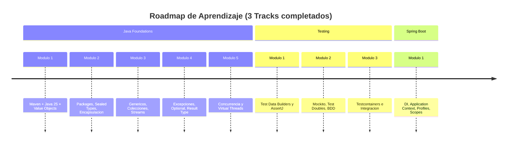

---

# Track 1: Java Foundations

## Modulo 1 — Setup & Value Objects

### Stack Tecnico
- **Java 25** con `<maven.compiler.release>25</maven.compiler.release>`
- **Maven** con UTF-8, JUnit 5/6, perfil de test funcional
- Primer test: `VerifyTest` para validar toolchain

### Value Objects (Objetos de Valor)

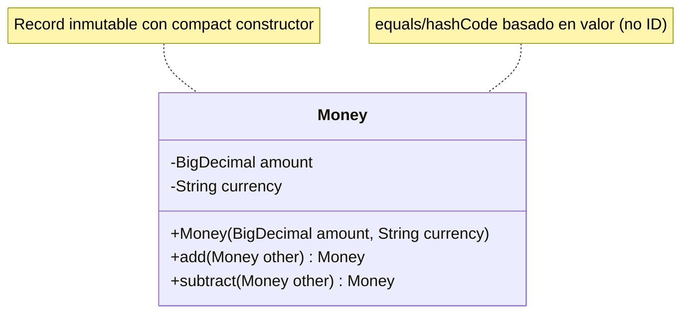

**Concepto clave:** Un Value Object se identifica por sus propiedades, no por un ID. `Money(5, "USD")` es estructuralmente igual a otro `Money(5, "USD")`.

**Compact Constructor:**
```java
public record Money(BigDecimal amount, String currency) {
    public Money {
        Objects.requireNonNull(amount, "Amount cannot be null");
        Objects.requireNonNull(currency, "Currency cannot be null");
        // Normalizar scale para evitar el BigDecimal Scale Trap
        amount = amount.setScale(2, RoundingMode.HALF_UP);
    }
}
```

### BigDecimal Scale Trap

```mermaid
flowchart LR
    A[new BigDecimal&#40;"5"&#41;] --> C{equals&#40;fivePointZero&#41;}
    B[new BigDecimal&#40;"5.0"&#41;] --> C
    C -->|FALSE| D[Scale diferente: 0 vs 1]
    C -->|compareTo = 0| E[Solucion: usar compareTo&#40;&#41;]
    D --> F[Record hereda equals del campo]
    F --> G[Normalizar scale en compact constructor]
```

| Operacion | `5.equals(5.0)` | `5.compareTo(5.0)` |
|-----------|-----------------|-------------------|
| Resultado | `false` (scale 0 vs 1) | `0` (mismo valor) |

**Leccion:** En Records con `BigDecimal`, normaliza el scale en el compact constructor.

---

## Modulo 2 — Packages, Encapsulacion y Sealed Types

### Arquitectura de Paquetes


### Sealed Interface + Switch Pattern Matching

```java
public sealed interface DiscountPolicy
    permits PercentageDiscount, AbsoluteDiscount, NoDiscount {}

// Implementaciones package-private
record PercentageDiscount(BigDecimal percentage) implements DiscountPolicy {}
record AbsoluteDiscount(Money amount) implements DiscountPolicy {}
record NoDiscount() implements DiscountPolicy {}

// Switch exhaustivo -- sin default necesario
public Money applyDiscount(Money original, DiscountPolicy policy) {
    return switch (policy) {
        case PercentageDiscount p -> original.applyPercentage(p.percentage());
        case AbsoluteDiscount a -> original.subtract(a.amount());
        case NoDiscount _ -> original;
    };
}
```

**Beneficios:**
- Compilador verifica que todos los casos estan cubiertos
- Sin `default` gracias a `sealed`
- Implementaciones ocultas del exterior (package-private)
- `_` (unnamed variable, Java 22+) para parametros no usados

---

## Modulo 3 — Genericos, Colecciones y Streams

### InMemoryRepository Generico

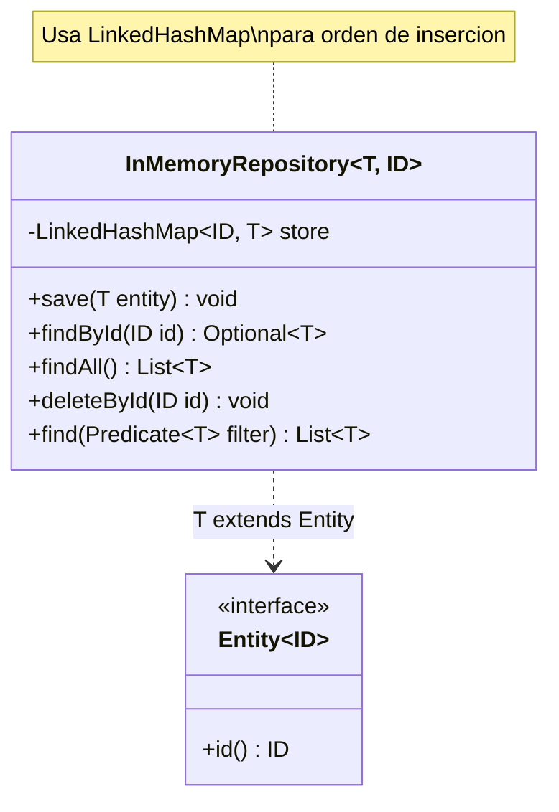

**Implementaciones clave:**
```java
// Single lookup (O(1) en vez de 2)
public Optional<T> findById(ID id) {
    return Optional.ofNullable(store.get(id));  // 1 lookup
}

// Defensive copy
public List<T> findAll() {
    return List.copyOf(store.values()); // Inmutable
}

// update in-place sin perder orden de insercion
public void save(T entity) {
    store.put(entity.id(), entity); // LinkedHashMap preserva orden
}
```

### Streams API — Operaciones Clave

```mermaid
flowchart LR
    subgraph Stream Pipeline
        A[Collection] --> B[.stream&#40;&#41;]
        B --> C[.filter&#40;predicate&#41;]
        C --> D[.map&#40;function&#41;]
        D --> E[.collect&#40;Collectors&#41;]
    end
    E --> F[List, Set, Map, etc.]
```

---

## Modulo 4 — Error Handling, Optional y Result Type

### Jerarquia de Excepciones vs Result Type

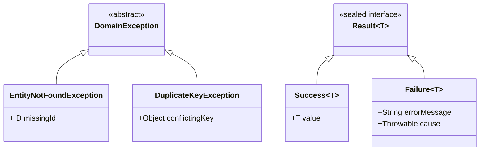

### Optional Pipeline — Estilo Funcional

```java
// Antipatron: if-isPresent
public Optional<Money> findDiscountedPrice(String id, DiscountPolicy policy) {
    Optional<Product> opt = repository.findById(id);
    if (opt.isPresent()) {
        Product p = opt.get();
        return Optional.of(discountService.applyDiscount(p.price(), policy));
    }
    return Optional.empty();
}

// Estilo funcional con pipelines
public Optional<Money> findDiscountedPrice(String id, DiscountPolicy policy) {
    return repository.findById(id)
        .map(product -> discountService.applyDiscount(product.price(), policy));
}
```

### Result Type — Manejo como Datos

```java
// En lugar de throw, devolvemos un Result
public Result<Product> trySave(Product product) {
    if (store.containsKey(product.id())) {
        return new Failure<>("Product already exists", null);
    }
    store.put(product.id(), product);
    return new Success<>(product);
}

// Consumidor con switch expression
switch (result) {
    case Success<Product> s -> log.info("Saved: {}", s.value());
    case Failure<Product> f -> log.warn("Failed: {}", f.errorMessage());
}
```

---

## Modulo 5 — Concurrencia y Virtual Threads

### Platform Threads vs Virtual Threads

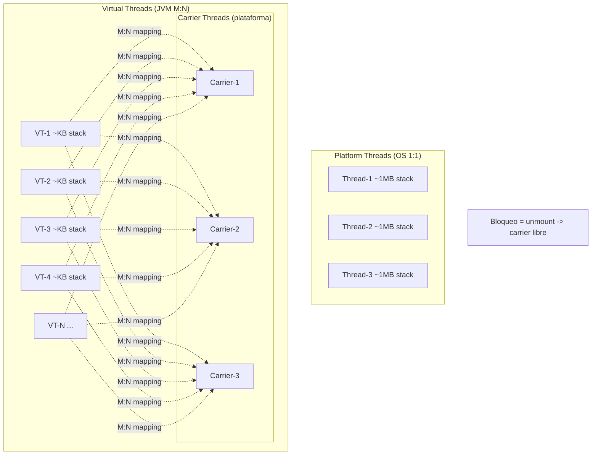

### Pinning Demo

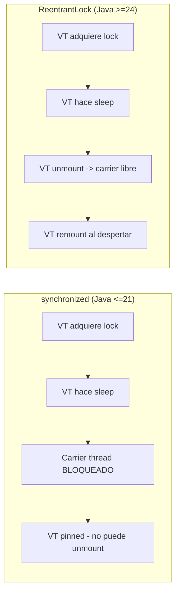

**JEP 491 — Synchronized Unmounting (Java 24+):** Desde Java 24, `synchronized` ya no pinnea virtual threads.

### Throughput — 100 Tareas Bloqueantes

| Escenario | Pool | Tiempo |
|-----------|------|--------|
| 100 tareas, pool 5 threads | `newFixedThreadPool(5)` | ~20s |
| 100 tareas | `newVirtualThreadPerTaskExecutor()` | ~1s |

**Leccion:** Lock contention serializa, no acelera. Usa locks solo para seguridad, nunca esperes velocidad.

---

# Track 2: Testing

## Modulo 1 — Test Data Builders y AssertJ

### Patron Builder para Tests

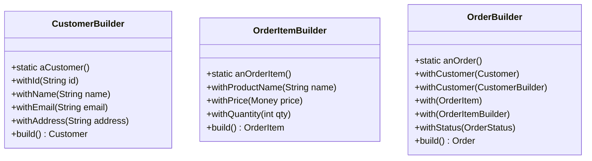

**Uso en tests:**
```java
// Setup limpio y expresivo
Order order = anOrder()
    .withCustomer(aCustomer().withEmail("invalid-email"))
    .with(anOrderItem().withPrice(new Money(BigDecimal.valueOf(120), "EUR")))
    .build();
```

### AssertJ — Aserciones Fluentes

| Concepto | AssertJ | vs JUnit nativo |
|----------|---------|-----------------|
| BigDecimal | `isEqualByComparingTo(expected)` | `assertEquals` falla por scale |
| Excepciones | `assertThatThrownBy(() -> ...).isInstanceOf(...)` | `assertThrows` + mensaje manual |
| Colecciones | `assertThat(list).containsExactly(a, b, c)` | `assertEquals` fragil |
| Mensajes | `.withFailMessage("Context: %s", ctx)` | Sin contexto |

---

## Modulo 2 — Mockito y Test Doubles

### BDDMockito — Given / When / Then

```mermaid
flowchart LR
    subgraph "Given (Stubbing)"
        G[given&#40;gateway.charge&#40;order&#41;&#41;.willReturn&#40;SUCCESS&#41;]
    end
    subgraph "When (Action)"
        W[result = processor.process&#40;order&#41;]
    end
    subgraph "Then (Verification)"
        T[then&#40;repo&#41;.should&#40;&#41;.save&#40;order&#41;]
    end
    G --> W --> T
```

**Fake vs Mock vs Stub:**
```java
// Fake -- implementacion real simplificada
class FakeOrderRepository implements OrderRepository {
    private final Map<String, Order> store = new HashMap<>();
}

// Mock (verificacion de comportamiento)
then(orderRepository).should().save(order);

// Stub (configuracion de respuesta)
given(paymentGateway.charge(order)).willReturn(PaymentResult.SUCCESS);
```

### Switch Expressions para Orquestacion

```java
return switch (charge) {
    case SUCCESS -> {
        order.complete();
        orderRepository.save(order);
        yield true;
    }
    case FAILURE -> {
        inventoryService.release(order);
        order.cancel();
        orderRepository.save(order);
        yield false;
    }
};
```

---

## Modulo 3 — Testcontainers e Integracion

### Arquitectura de Test con Testcontainers

```mermaid
flowchart TB
    subgraph "JVM - Suite de Tests"
        IT[Integration Test Class]
        SC[PostgreSQLContainer&#60;?&#62; static]

        subgraph "Cada @Test"
            TRUNC[TRUNCATE TABLE]
            TEST[Test Logic]
        end

        IT --> SC
        SC -->|getJdbcUrl&#40;&#41;| JDBC_URL
        IT --> TRUNC
        TRUNC --> TEST
    end

    subgraph "Docker"
        PG[PostgreSQL 16 Container]
    end

    SC -->|init| PG
```

### Patron Singleton Container

```java
@SpringBootTest
class JdbcProductRepositoryIT {

    // Singleton: un container para toda la suite
    static final PostgreSQLContainer<?> postgres =
        new PostgreSQLContainer<>("postgres:16");

    @BeforeAll
    static void startContainer() {
        postgres.start(); // Una sola vez
    }

    @BeforeEach
    void cleanDatabase() {
        jdbcTemplate.execute("TRUNCATE TABLE products");
    }
}
```

### JDBC Best Practices

```mermaid
flowchart LR
    A[try-with-resources] --> B[Connection]
    A --> C[PreparedStatement]
    A --> D[ResultSet]
    C -->|executeUpdate&#40;&#41;| E[INSERT, UPDATE, DELETE]
    C -->|executeQuery&#40;&#41;| F[SELECT -> ResultSet]
    F --> G[resultSet.getString&#40;"name"&#41;]
    note[Columna por nombre > columna por indice]
```

---

# Track 3: Spring Boot

## Modulo 1 — Dependency Injection y Application Context

### Arquitectura DI

```mermaid
classDiagram
    class ApplicationContext {
        BeanFactory
    }

    class NotificationService {
        -MessageRepository repository
        -NotificationSender sender
        -RequestIdGenerator idGen
    }

    class MessageRepository {
        <<interface>>
    }
    class InMemoryMessageRepository {
        -RequestIdGenerator idGen
    }

    class NotificationSender {
        <<interface>>
    }
    class EmailNotificationSender {
    }
    class SmsNotificationSender {
    }

    class RequestIdGenerator {
        <<prototype scope>>
        +generateId() String
    }

    ApplicationContext --> EmailNotificationSender : @Profile&#40;"email"&#41;
    ApplicationContext --> SmsNotificationSender : @Profile&#40;"sms"&#41;
    NotificationService --> MessageRepository : Constructor Injection
    NotificationService --> NotificationSender : Constructor Injection
    InMemoryMessageRepository ..|> MessageRepository
    EmailNotificationSender ..|> NotificationSender
    SmsNotificationSender ..|> NotificationSender
    NotificationService --> RequestIdGenerator : new instance
    InMemoryMessageRepository --> RequestIdGenerator : new instance
```

### Constructor Injection — Por que es la mejor opcion

| Razon | Detalle |
|-------|---------|
| Inmutabilidad | Campos `private final` — las dependencias no cambian |
| Sin `@Autowired` | Si hay un solo constructor, Spring lo usa automaticamente |
| Testabilidad | `new Service(mockRepo, mockSender)` sin Spring |
| Proteccion circular | Spring lanza `BeanCurrentlyInCreationException` al detectar ciclos |

```java
@Service
public class NotificationService {
    private final MessageRepository repository;
    private final NotificationSender sender;

    // Sin @Autowired -- Spring inyecta automaticamente
    public NotificationService(MessageRepository repository,
                               NotificationSender sender) {
        this.repository = repository;
        this.sender = sender;
    }
}
```

### Profiles — Beans Condicionales

```java
@Component
@Profile("email")
public class EmailNotificationSender implements NotificationSender {}

@Component
@Profile("sms")
public class SmsNotificationSender implements NotificationSender {}
```

```java
// Test para profile "email"
@SpringBootTest
@ActiveProfiles("email")
class EmailProfileTest {
    @Autowired NotificationSender sender;

    @Test
    void shouldResolveEmailSender() {
        assertThat(sender).isInstanceOf(EmailNotificationSender.class);
    }
}
```

### Scopes — Singleton vs Prototype

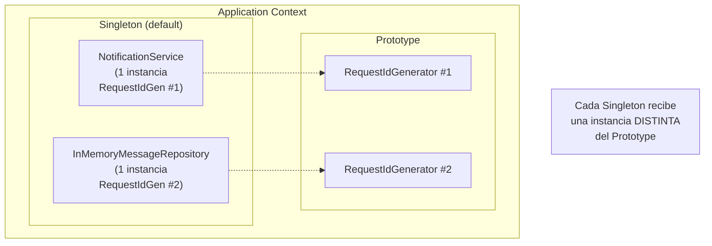

**Singleton Injection Trap:** Si un Prototype se inyecta en un Singleton, el Prototype se inyecta solo una vez. Para resolverlo: usa `ObjectProvider<T>` o `@Lookup`.

### Maven Surefire — Incluir Integration Tests

```xml
<plugin>
    <groupId>org.apache.maven.plugins</groupId>
    <artifactId>maven-surefire-plugin</artifactId>
    <configuration>
        <includes>
            <include>**/*Test.java</include>
            <include>**/*IT.java</include>  <!-- Sin esto, no corren -->
        </includes>
    </configuration>
</plugin>
```

---

# Inventario de Aprendizaje Futuro

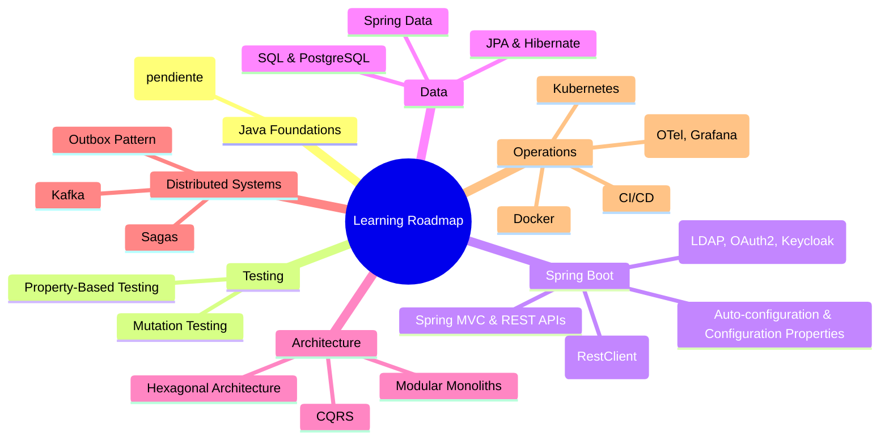

---

# Anti-Patrones y Lecciones Aprendidas

## 1. No uses `containsKey()` + `get()` en Maps
```java
// 2 lookups en la hash table
if (map.containsKey(id)) {
    return Optional.of(map.get(id));
}

// 1 lookup
return Optional.ofNullable(map.get(id));
```

## 2. No expongas colecciones internas
```java
// Caller puede hacer repo.findAll().clear()
public List<T> findAll() { return store.values(); }

// Defensive copy inmutable
public List<T> findAll() { return List.copyOf(store.values()); }
```

## 3. BigDecimal: usa `compareTo()`, no `equals()`
```java
// Falso por scale
new BigDecimal("5").equals(new BigDecimal("5.0"))  // false

// Correcto
new BigDecimal("5").compareTo(new BigDecimal("5.0")) == 0  // true
```

## 4. Optional: pipelines funcionales, no `isPresent() + get()`
```java
// Imperativo
temp find() {
    var opt = repo.findById(id);
    if (opt.isPresent()) { return opt.get().price(); }
    throw new NotFoundException();
}

// Funcional
return repo.findById(id)
    .map(Product::price)
    .orElseThrow(() -> new EntityNotFoundException(id));
```

## 5. Locks son para seguridad, no velocidad
Los locks serializan. No hacen el codigo mas rapido. Los usamos para proteger **estado mutable compartido** de race conditions.

## 6. Test Data Builders > constructores en tests
Si el constructor de dominio cambia, los builders absorben el cambio en un solo lugar. Los tests quedan limpios.

## 7. Singleton container de Testcontainers
Un `static PostgreSQLContainer` para toda la suite. Boot rapido (~3-8s una vez) + `@BeforeEach` con TRUNCATE para aislamiento.

---

# Resumen de Issues Completados

| # | Issue | Track | Estado |
|---|-------|-------|--------|
| 001 | Setup Maven + Java 25 | Java Foundations | OK |
| 002 | Value Objects & Invariants (Money) | Java Foundations | OK |
| 003 | Sealed Types, Packages, Discount | Java Foundations | OK |
| 004 | Genericos, InMemoryRepository | Java Foundations | OK |
| 005 | Excepciones, Optional, Result Type | Java Foundations | OK |
| 006 | Concurrencia & Virtual Threads | Java Foundations | Pendiente |
| 007 | Test Data Builders & AssertJ | Testing | OK |
| 008 | Mockito, BDD, Test Doubles | Testing | OK |
| 009 | Testcontainers & PostgreSQL | Testing | OK |
| 010 | Spring DI & Application Context | Spring Boot | OK |

---

_Este resumen se genero a partir de los contenidos del repositorio `learning`._
